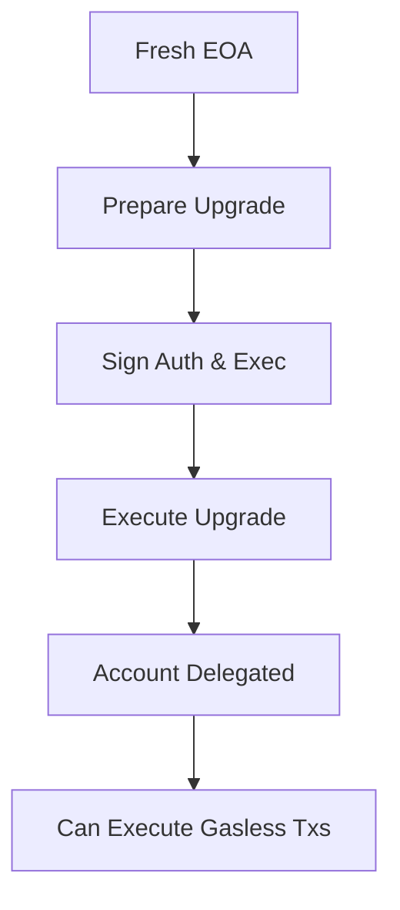
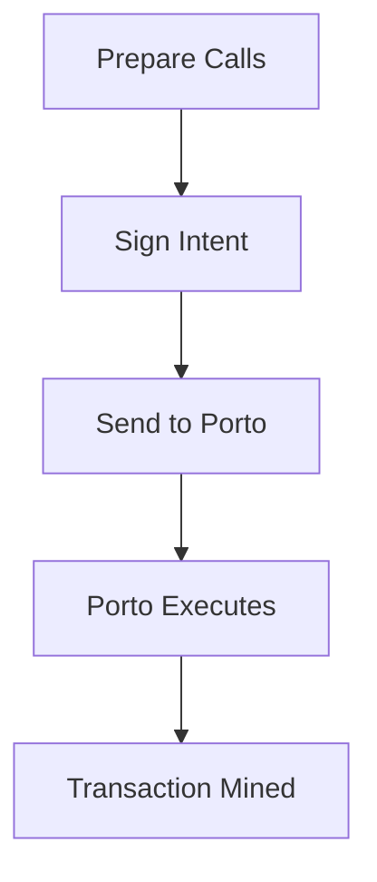

# FrenPet Mobile - Technical Architecture

## Overview

FrenPet is a React Native mobile app that interacts with RISE blockchain through Porto relay for gasless transactions.

## Technology Stack

- **Mobile**: React Native + Expo
- **Blockchain**: RISE Testnet (Sepolia fork, Chain ID: 11155931)
- **Gasless Relay**: Porto Protocol
- **Smart Contracts**: Solidity (FrenPet game contract)
- **State Management**: React hooks
- **Storage**: AsyncStorage (with SecureStore fallback)

## Architecture Components

### 1. Mobile App (`/mobile`)

```
src/
├── components/          # UI Components
│   ├── PetCard.tsx     # Pet display component
│   └── BattleModal.tsx # Battle interface
├── hooks/              # React Hooks
│   ├── useFrenPet.ts   # Game logic hook
│   ├── usePorto.ts     # Porto relay hook
│   └── useWallet.ts    # Wallet management
├── lib/                # Core Libraries
│   ├── portoClient.native.ts  # Porto client
│   ├── sessionWallet.ts       # Session key wallet
│   ├── accountUpgrade.ts      # Delegation logic
│   └── storage.ts             # Storage abstraction
└── screens/            # App Screens
    ├── HomeScreen.tsx  # Main screen
    └── PetScreen.tsx   # Pet interaction
```

### 2. Porto Integration

Porto enables gasless transactions through account delegation and intent-based execution.

#### Key Components:

1. **Account Delegation** - Upgrades EOA to smart contract wallet
2. **Intent Signing** - EIP-712 typed data signatures
3. **Gasless Execution** - Porto pays gas, users sign intents

### 3. Smart Contracts (`/contracts`)

- **FrenPet.sol**: Main game contract
  - Pet creation and management
  - Feeding and playing mechanics
  - Battle system with VRF randomness
  - Experience and leveling

## Porto Relay Integration

### Account Delegation Flow



### Transaction Flow



## Wallet Architecture

### Session Key System

1. **Main Wallet** - Stored securely, used for delegation
2. **Session Keys** - Temporary keys for signing intents
3. **Porto Client** - Handles relay communication

### Storage

- **Main Key**: Stored in SecureStore/AsyncStorage
- **Session Key**: Temporary, rotated periodically
- **Delegation Status**: Cached locally

## Network Configuration

```typescript
const riseTestnet = {
  id: 11155931,
  name: 'RISE Testnet',
  rpcUrls: {
    default: { http: ['https://testnet.riselabs.xyz'] },
  },
};
```

## Key Files

### Core Integration
- `mobile/src/lib/portoClient.native.ts` - Porto relay client
- `mobile/src/lib/accountUpgrade.ts` - Delegation logic
- `mobile/src/hooks/useFrenPet.ts` - Game logic integration

### Configuration
- `mobile/src/config/chain.ts` - Network configuration
- `mobile/src/config/contracts.ts` - Contract addresses and ABIs

### Tests
- `tests/test-delegation-simple.js` - Delegation flow test
- `tests/test-auto-delegation.js` - Automatic delegation test

## Error Codes

- `0xfbcb0b34` - Account not delegated to Porto
- `-32602` - Invalid params (API format issue)
- `-32603` - Internal error (RPC or database issue)

## Development Workflow

1. **Setup Environment**
   ```bash
   cd mobile
   npm install
   ```

2. **Run Development Server**
   ```bash
   npx expo start
   ```

3. **Test Porto Integration**
   ```bash
   node tests/test-delegation-simple.js
   ```

4. **Deploy Contract Updates**
   ```bash
   cd contracts
   forge script script/DeployFrenPet.s.sol --rpc-url $RPC_URL
   ```

## Troubleshooting

### Common Issues

1. **Delegation Failures**
   - Ensure expiry is hex string format
   - Check account has no existing code
   - Verify Porto relay is accessible

2. **Transaction Failures**
   - Error `0xfbcb0b34`: Account needs delegation
   - Check gas limits and fee configuration
   - Verify signature format

3. **Network Issues**
   - Ensure correct RPC URL and chain ID
   - Check Porto relay health endpoint
   - Verify contract addresses

## Security Considerations

1. **Private Key Management**
   - Never expose private keys in code
   - Use secure storage for production
   - Rotate session keys regularly

2. **Signature Verification**
   - Always verify intent signatures
   - Check nonce to prevent replay attacks
   - Validate transaction parameters

3. **Contract Security**
   - Audit smart contracts before mainnet
   - Implement access controls
   - Use battle-tested libraries